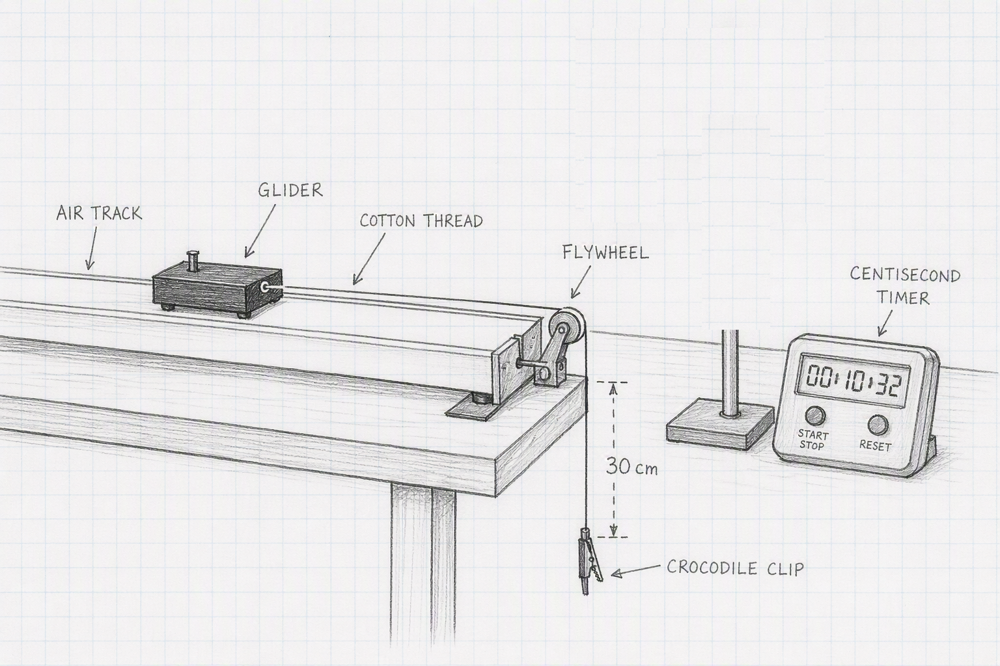
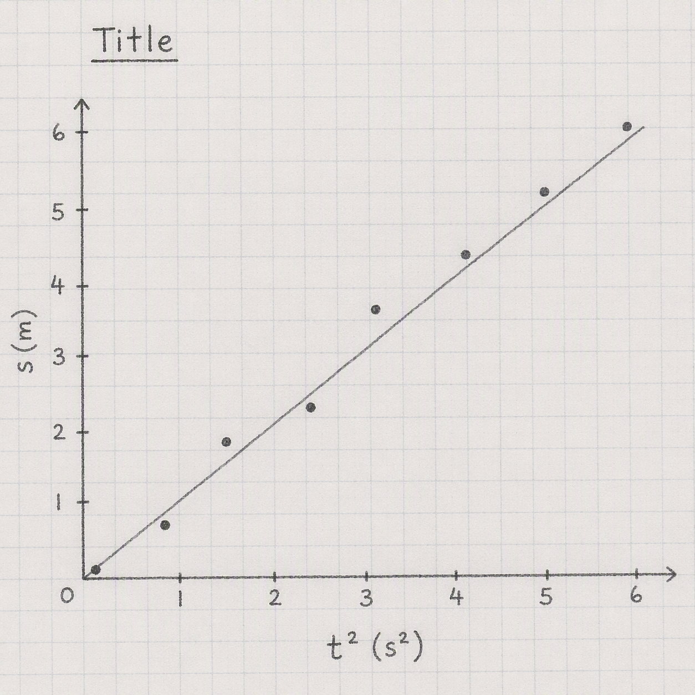

```{css, echo = FALSE}
.justify {
  text-align: justify !important
}
```

# Measurement of Acceleration on a Linear Air-Track

Today we're going to investigate the kinematic equations of motion, specifically $s \; = \; v_0 t \; + \; \frac{1}{2} a t^2$. To do this we need constant acceleration in a frictionless environment and to achieve this we use an *air track* where a glider floats on a cushion of air blown through holes in the track.

Take down the following in to your laboratory copy.

### [Measurement of Acceleration on a Linear Air Track]{style="font-family:Kalam;color:#8b1a1a;"}{.unnumbered}

### [Name:]{style="font-family:Kalam;color:#8b1a1a;"}{.unnumbered}

### [Date:]{style="font-family:Kalam;color:#8b1a1a;"}{.unnumbered}

### [Partner:]{style="font-family:Kalam;color:#8b1a1a;"}{.unnumbered}

### [Data:]{style="font-family:Kalam;color:#8b1a1a;"}{.unnumbered}

```{r}
#| warning: false
#| message: false
#| echo: false
#| label: track_table
#| classes: plain

library(tidyverse)
library(gt)

z <- tibble(s = seq(0.200, 0.800, by = 0.100) |> signif(digits = 4), 
            t1 = rep("", 7), 
            t1_2 = rep("", 7)
             )

z |> 
  gt() |> 
  cols_label(s = "s(m)",
             t1 = md("$t(s)$"),
             t1_2 = md("$t^2(s^2)$")) |> 
  cols_width(everything() ~ px(100)) |> 
  fmt_number(columns = s,
             decimals = 3) |> 
  cols_align(columns = everything(),
             align = "center") |> 
  tab_options(container.width = 800,
              table_body.border.bottom.style = "solid",
              table_body.border.bottom.width = "2px",
              table_body.border.bottom.color = "firebrick4",
              column_labels.border.top.style = "solid",
              column_labels.border.top.width = "2px",
              column_labels.border.top.color = "firebrick4",
              table_body.vlines.style = "solid",
              table_body.vlines.width = "2px",
              table_body.vlines.color = "firebrick4",
              column_labels.vlines.style = "solid",
              column_labels.vlines.width = "2px",
              column_labels.vlines.color = "firebrick4") |> 
  tab_options(table.width = pct(70),
              page.margin.left = "3.0in",
              page.margin.right = "3.0in",
              container.width = pct(75)) |> 
  cols_width(everything() ~ pct(50 / ncol(z))) |> 
  opt_table_font(size = 17, 
                 font = google_font("Kalam"), 
                 color = "firebrick4") |> 
  opt_vertical_padding(scale = 0.1) |> 
  opt_horizontal_padding(scale = 0.1)

```

## Experimental Set-Up

:::::: columns
::: {.column width="40%"}
{height="6.5cm" width="9cm"}
:::

::: {.column width="15%"}
:::

::: {.column width="45%"}
::: {.justify}
The apparatus will be set-up something like the sketch on the left. The glider is pulled back so that its front edge just touches the 0.300m point on the track. It is gently released and will accelerate towards the end of the track. The timer is started when the glider is released, and is stopped as the front edge of the glider passes the 0.100m mark on the track. This is the first point, s = 0.200m.
:::
:::
::::::

- before you begin your measurements make sure the track is level by detaching the cotton thread from the glider and seeing if the glider moves off in any direction. If not level, the track can be adjusted by the rubber screws on each leg.

- make sure you release the glider from rest, without giving it a push in either direction

- make sure the crocodile clip is still above ground when the glider passes the finish (0.100m) line so that it is always accelerating.

- check to make sure the cotton thread is still running over the flywheel after each measurement.

- When filling out your table, pay special attention to significant figures. The number of significant figures for $t$ should be the same as for $t^2$.

## Analysis

:::::: columns
::: {.column width="40%"}
{height="8cm" width="7cm"}
:::

::: {.column width="5%"}
:::

::: {.column width="45%"}
:::{.justify}
Draw the graph as shown on the left here, with $t^2(s^2)$ on the x-axis and $s(m)$ on the y axis. Don't be surprised if there is a reasonable amount of scatter in the points. Draw a best fit line nested through the points. Make sure the graph has a (long) descriptive title in the form *What's on y-axis vs What's on x axis and the context*.

Calculate the slope of the best fit line using the formula $slope \; = \; \frac{y_2-y_1}{x_2-x_1}$
:::
:::
::::::

## Calculation of the acceleration, a

The kinematic equation of relevance here is:

$s \; = \; v_0 t \; + \; \frac{1}{2} a t^2$

Where $v_o$ is the initial velocity which will be zero and we can ignore that. So $s \; = \; \frac{1}{2} a t^2$.

This means the slope of our graph will be $\frac{1}{2}a$ so $a$ is twice the slope.

We're going to check on our acceleration value by a separate set of measurements. Detach the crocodile clip and the glider from the apparatus and weight each separately, let's call the results $m_{glider}$ and $m_{clip}$. From Newton's Laws, $F \; = \; ma$ where in this ccase the force causing the acceleration is the weight of the clip, $F = W = m_{clip} \times g$ and $m$ is the $total \; mass = m_{glider} + m_{clip}$.

So we get $a_{theory} = \frac{m_{clip} \times g}{m_{glider} + m_{clip}}$. Use the masses you measured and $g = 9.81 \; m/s^2$ to work out this second value for $a$.

## Discussion

There are four parts to the discussion section:

- ***the main results*** - repeat the value of $a$ obtained from the end of your calculations. Even though it is written elsewhere in your report, it's important to repeat it here.

- ***the text book (reference) value*** - repeat the value you have for $a_{theory}$ here.

- ***inaccuracies*** - your values for $a$ won't be exactly the same, nor will your graph be a perfect straight line. We need to try and account for these discrepancies. Pick one feature of the experiment and investigate whether it is an issue in the accuracy of your results. For example, how reliable are the (very short) times measured in the results table, maybe we should repeat for one value of $s$ and see how consistent they are. You'll need to examine the results you have already as well as gathering additional evidence by taking further measurements. Your idea might well be a key issue in the quality of the results we obtain, or it might not be and you are thus ruling it out. Both are valid outcomes of this error analysis.

- ***improvements*** - based on the inaccuracy section above, can you suggest a way in which we could make our experiment better?

## Apparatus

Levelled linear air track with glider in place attached to a cotton thread which runs frictionlessly over a flywheel. The thread is long enough to hit the floor with the glider at the end of its travel. A centisecond timer. Weighing scales with a range of at least 0-200g and a sensitivity of 0.01g.
