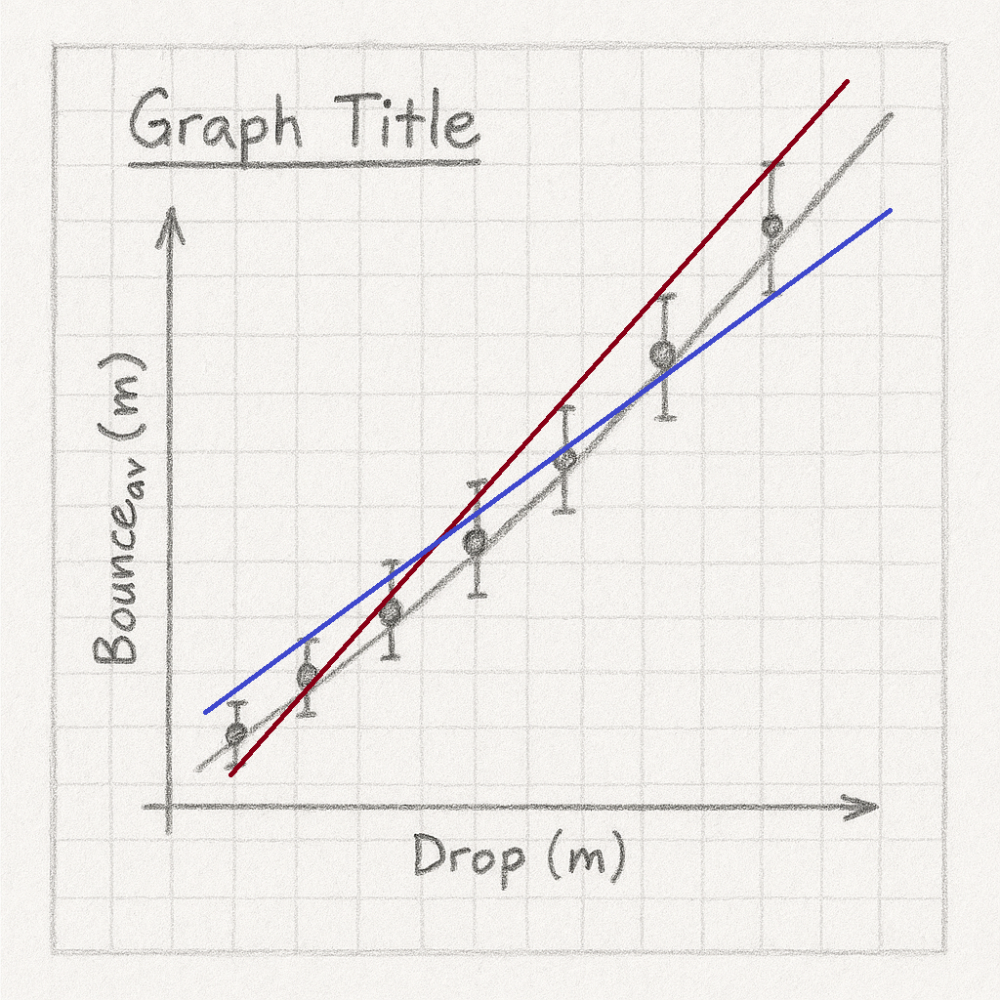

```{css, echo = FALSE}
.justify {
  text-align: justify !important
}
``` 

# Coefficient of Restitution of a Ping Pong Ball

In any collision there is balance between elastic and inelastic forces. Inelastic forces lead to losses in mechanical energies and dissipation of such energies in the form of non-mechanical energies such as heat and sound. The parameter that describes how elastic a collision is is called the Coefficient of Restitution (COR). It is a dimensionless number that essentially says how bouncy something is; for a rubber super ball it'll be close to 1, for a water balloon it'll be close to zero. We're going to measure this for a ping pong ball by dropping it from various heights and recording how high it rebounds.

Take down the following in to your laboratory copy.

### [Title: Coefficient of Restitution of a Ping Pong Ball]{style="font-family:Kalam;color:#8b1a1a;"}{.unnumbered}

### [Name:]{style="font-family:Kalam;color:#8b1a1a;"}{.unnumbered}

### [Date:]{style="font-family:Kalam;color:#8b1a1a;"}{.unnumbered}

### [Partner:]{style="font-family:Kalam;color:#8b1a1a;"}{.unnumbered}

### [Data:]{style="font-family:Kalam;color:#8b1a1a;"}{.unnumbered}

```{r}
#| warning: false
#| message: false
#| echo: false
#| label: cor_table
#| classes: plain

library(tidyverse)
library(gt)

z <- tibble(drop = seq(0.600, 2.000, by = 0.200) |> signif(digits = 4), 
            b1 = rep("", 8), 
            b2 = rep("", 8), 
            b3 = rep("", 8),
            b4 = rep("", 8),
            b5 = rep("", 8),
            b_av = rep("", 8),
            b_min = rep("", 8),
            b_max = rep("", 8)
             )

z |> 
  gt() |> 
  cols_label(drop = "Drop(m)",
             b1 = md("$B_1(m)$"),
             b2 = md("$B_2(m)$"),
             b3 = md("$B_3(m)$"),
             b4 = md("$B_4(m)$"),
             b5 = md("$B_5(m)$"),
             b_av = md("$B_{av}(m)$"),
             b_min = md("$B_{min}(m)$"),
             b_max = md("$B_{max}(m)$")) |> 
  cols_width(drop ~ px(100),
             b1 ~ px(80),
             everything() ~ px(60)) |> 
  fmt_number(columns = drop,
             decimals = 3) |> 
  cols_align(columns = everything(),
             align = "center") |> 
  tab_options(container.width = 800,
              table_body.border.bottom.style = "solid",
              table_body.border.bottom.width = "2px",
              table_body.border.bottom.color = "firebrick4",
              column_labels.border.top.style = "solid",
              column_labels.border.top.width = "2px",
              column_labels.border.top.color = "firebrick4",
              table_body.vlines.style = "solid",
              table_body.vlines.width = "2px",
              table_body.vlines.color = "firebrick4",
              column_labels.vlines.style = "solid",
              column_labels.vlines.width = "2px",
              column_labels.vlines.color = "firebrick4") |> 
  tab_options(
    column_labels.font.size = 13,
    data_row.padding = px(-5),
    table.width = pct(75),
    container.overflow.x = FALSE, # Disables horizontal scroll
    container.overflow.y = FALSE ,
    page.margin.left = "0.0in",
    page.margin.right = "0.0in",
    container.width = pct(85),# Disables vertical scroll
  ) |> 
  opt_table_font(size = 17, font = google_font("Kalam"), color = "firebrick4") |> 
  opt_vertical_padding(scale = 0.1)

```

## Experimental Set-Up

The table tennis ball is dropped from various height in front of the metre sticks and the bounce height recorded. Because it is difficult to accurately record the bounce height, each measurement is repeated five times and an average is taken. The $B_{av}$ column is the averagee for the five bounces for a particular drop height, making sure you have the right number of significant figures in $B_{av}$. The $B_{min}$ and $B_{max}$ columns are the smallest and largets of the five measurements

Things to watch out for:

- because floor level is at 0.000m, measure the drop height and the bounce heights from the ***bottom*** of the ping pong ball.

- because things happen fast, it can be useful to video record the bounce on your phone to capture the apex of the bounce.



## Analysis

:::::: columns
::: {.column width="45%"}
{height="9.0cm" width="8cm"}
:::

::: {.column width="5%"}
:::

::: {.column width="50%"}
::: {.justify}
Draw the graph as shown on the left here, with $B_{av}(m)$ on the y-axis and $Drop(m)$ on the x axis. Don't be surprised if there is a reasonable amount of scatter in the points. Instead of drawing circles around each point, we'll represent them by chi-fighter like points where the centre dot is at $B_{av}$, the top line at $B_{max}$, and the bottom line at $B_{min}$. Draw a best fit line nested through the points. Draw a steepest possible line \~consistent with the chi-fighters (shown in red pencil in our graph here). Draw a shallowest possible line \~consistent with the chi-fighters (shown in blue). Calculate the slopes of all three lines
:::
:::
::::::

## Calculation of the COR

The equation governing COR is:

$COR \; = \; \frac{speed\ of\ separation\ after\ impct}{speed\ of\ approach\ before\ impart}$

Using the equations of motion we get the more useful expression, and the one we’ll use for this experiment:

$COR \; = \; \sqrt{\frac{bounce\ height}{drop\ height}}$

This means the slope of our $B_{av} \; vs \; Drop$ graph must be:

$slope \; = \; COR^2 \; \implies\; COR \; = \; \sqrt{slope}$

Do this for all three lines, giving $COR_{av}$, $COR_{min}$, and $COR_{max}$.

## Discussion

There are four parts to the discussion section. Because we have three experimental values for COR, we'll combine our results and textbook value in a table

- ***the main results and textbook value***

```{r}
#| warning: false
#| message: false
#| echo: false
#| label: f_table
#| classes: plain

library(tidyverse)
library(gt)

z <- tibble(source = c("Average", "Maximum", "Minimum", "Textbook"),
            value = c("", "", "", "0.65"))

z |> gt() |> 
  cols_label(source = "Source",
             value = "COR") |> 
  tab_options(
    column_labels.font.size = 15,
    data_row.padding = px(-5),
    table.width = pct(25),
    container.overflow.x = FALSE, # Disables horizontal scroll
    container.overflow.y = FALSE  # Disables vertical scroll
  ) 


```

- ***inaccuracies*** - your value for $COR$ won't be exactly the same as the manufacturers, nor will your graph be a perfect straight line. We need to try and account for these discrepancies. Pick one feature of the experiment and investigate whether it is an issue in the accuracy of your results. You'll need to examine the results you have already as well as gathering additional evidence by taking further measurements. Your idea might well be a key issue in the quality of the results we obtain, or it might not be and you are thus ruling it out. Both are valid outcomes of this error analysis.

- ***improvements*** - based on the inaccuracy section above, can you suggest a way in which we could make our experiment better?

## Apparatus

Wall mounted measuring sticks to a height of 2m. Ping pong ball. Ceramic tile agt the bottom of metre sticks.
