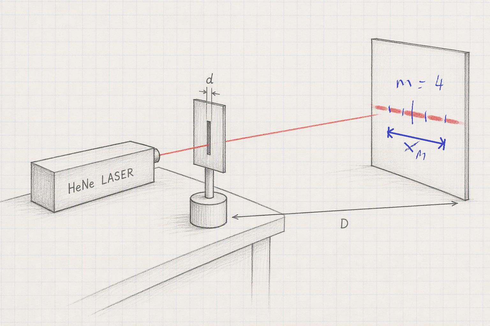
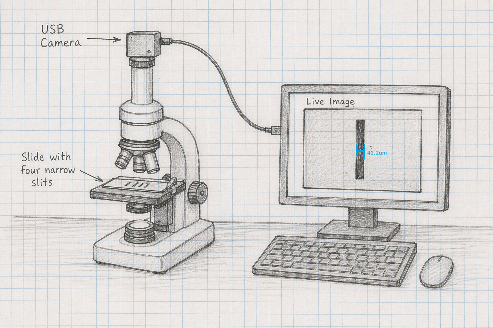

```{css, echo = FALSE}
.justify {
  text-align: justify !important
}
```

# Laser Diffraction

To measure the size of objects down to 1 mm we can use a meter stick. For smaller objects, down to $10 \mu m$, we can use a microscope. But for smaller again we need a new method that we'll introduce in this experiment. It relies on two optical phenomena; diffraction and interference.

### Diffraction {.unnumbered}

When waves pass through a narrow aperture, they fan out on the far side, like water waves passing through a harbour opening.

### Interference {.unnumbered}

Because light can act like a wave, two light beams can interfere *constructively* (when the wave crests align) or *destructively* (when a crest coincides with a trough). This will lead to bright and dark patches in an optical pattern.

Take down the following in to your laboratory copy. Note that we're working in millimeters today.

### [Title: Laser Diffraction]{style="font-family:Kalam;color:#8b1a1a;"} {.unnumbered}

### [Name:]{style="font-family:Kalam;color:#8b1a1a;"} {.unnumbered}

### [Date:]{style="font-family:Kalam;color:#8b1a1a;"} {.unnumbered}

### [Partner:]{style="font-family:Kalam;color:#8b1a1a;"} {.unnumbered}

### [Data:]{style="font-family:Kalam;color:#8b1a1a;"} {.unnumbered}

```{r}
#| warning: false
#| message: false
#| echo: false
#| label: laser_table
#| classes: plain

library(tidyverse)
library(gt)

z <- tibble(slit = c("A", "B", "C", "D", "Hair"),
            d_value = rep("", 5), 
            m_value = rep(".........", 5),
            xm_value = rep("", 5),
            my_d = rep("", 5)
            )

z |> 
  gt() |> 
  cols_label(slit = "Slit",
             d_value = "D(mm)",
             m_value = "  m  ",
             xm_value = md("$x_m(mm)$"),
             my_d = "d(mm)") |> 
  cols_width(everything() ~ px(120)) |> 
  cols_align(columns = everything(),
             align = "center") |> 
  tab_options(container.width = 800,
              table_body.border.bottom.style = "solid",
              table_body.border.bottom.width = "2px",
              table_body.border.bottom.color = "firebrick4",
              column_labels.border.top.style = "solid",
              column_labels.border.top.width = "2px",
              column_labels.border.top.color = "firebrick4",
              table_body.vlines.style = "solid",
              table_body.vlines.width = "2px",
              table_body.vlines.color = "firebrick4",
              column_labels.vlines.style = "solid",
              column_labels.vlines.width = "2px",
              column_labels.vlines.color = "firebrick4") |> 
  tab_options(
    data_row.padding = px(-5),
    page.margin.left = "3.0in",
    page.margin.right = "3.0in",
    container.width = pct(75),
    container.overflow.x = FALSE, # Disables horizontal scroll
    container.overflow.y = FALSE  # Disables vertical scroll
  ) |> 
  opt_table_font(size = 17, font = google_font("Kalam"), color = "firebrick4") |> 
  opt_vertical_padding(scale = 0.1) |> 
  tab_style(cell_text(color = "#fff"),
            locations = cells_body(columns = m_value))

```

## Experimental Set-Up

{height="10cm" width="18cm"}

Set up the apparatus something like the sketch above. Mark out the gaps in the diffraction pattern with the blue pen provided, as well as a mark in the very centre of the pattern. Count the chunks between marks, this is $m$. Measure the distances D and $x_m$ and note them in your table.

Use the equation $d \; = \; \frac{m \lambda x_m}{D}$ to calculate d. Repeat this for the four slits, A, B, C, and D as well as the hair sample. For the HeNe laser, the wavelength of light is $\lambda \; = \; 6.33 \times 10^{-4}mm$.

- We measure $D$ and $x_m$ to the nearest mm.

- When filling out your table, pay special attention to significant figures. The number of significant figures for $d$ is dictated by the smallest number of significant figures in either $D$ or $x_m$

## Microscope

::::::: columns
::: {.column width="65%"}
{height="8cm" width="10cm"}
:::

::: {.column width="1%"}
:::

:::: {.column width="34%"}
::: justify
With the help of the technician, place the slide with four slits in the microscope and use the camera software to measure each of the four slits. Now do the same for the hair sample. Record your answers in the table shown in the discussion section below.
:::
::::
:::::::

## Discussion

Use the table below to capture your ***main results*** and the ***textbook answers***.

```{r}
#| warning: false
#| message: false
#| echo: false
#| label: slit_table
#| classes: plain

library(tidyverse)
library(gt)

z <- tibble(slit = c("A", "B", "C", "D", "Hair"),
            d_value = rep("", 5), 
            micro_value = rep("", 5),
            text_value = c("0.02", "0.04", "0.08", "0.16", "")
)

z |> 
  gt() |> 
  cols_label(slit = "Slit",
             d_value = "Laser d(mm)",
             micro_value = md("\U03BCscope d(mm)"),
             text_value = md("Manufacturer d(mm)")) |> 
  cols_width(everything() ~ px(120)) |> 
  cols_align(columns = everything(),
             align = "center") |> 
  tab_options(container.width = 800,
              table_body.border.bottom.style = "solid",
              table_body.border.bottom.width = "2px",
              table_body.border.bottom.color = "firebrick4",
              column_labels.border.top.style = "solid",
              column_labels.border.top.width = "2px",
              column_labels.border.top.color = "firebrick4",
              table_body.vlines.style = "solid",
              table_body.vlines.width = "2px",
              table_body.vlines.color = "firebrick4",
              column_labels.vlines.style = "solid",
              column_labels.vlines.width = "2px",
              column_labels.vlines.color = "firebrick4") |> 
  tab_options(
    data_row.padding = px(-5),
    page.margin.left = "3.0in",
    page.margin.right = "3.0in",
    container.width = pct(75),
    container.overflow.x = FALSE, # Disables horizontal scroll
    container.overflow.y = FALSE  # Disables vertical scroll
  ) |> 
  tab_style(
    style = "background: linear-gradient(-45deg, rgb(139 26 26 / 30%) 25%, transparent 25%, transparent 50%, rgb(139 26 26 / 30%) 50%, rgb(139 26 26 / 30%) 75%, transparent 75%, transparent); background-size: 20px 20px;",
    #style = cell_fill(color = "#8b1a1a", alpha = 0.3), # Light gray with 50% opacity
    locations = cells_body(
      columns = text_value, 
      rows = text_value == ""
    )
  ) |> 
  opt_table_font(size = 17, font = google_font("Kalam"), color = "firebrick4") |> 
  opt_vertical_padding(scale = 0.1)

```

- ***inaccuracies*** - your d values won't be same for the laser and microscope, nor will they agree with the manufacturer's values for the slits. You need to explain these discrepancies. Also, look out for patterns in the table; e.g. is the laser always better than the microscope or vice versa, or does the laser do better for small slits and the microscope for the larger ones.....

- ***improvements*** - based on the inaccuracy section above, can you suggest a way in which we could make our experiment better?

## Apparatus

HeNe laser. Slide with four slits of 0.02mm, 0.04mm, 0.08mm, and 0.16mm. Slide holder. Empty slide and blutack. Blank screen. Whiteboard marker. Microscope with USB camera and Optik measurement software installed and interfaced.
