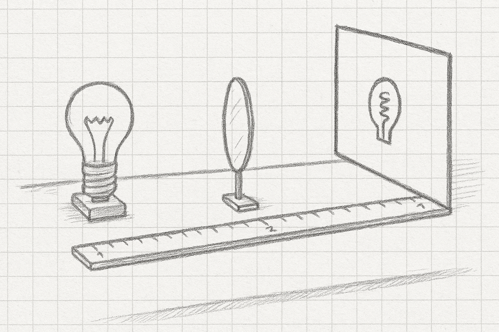
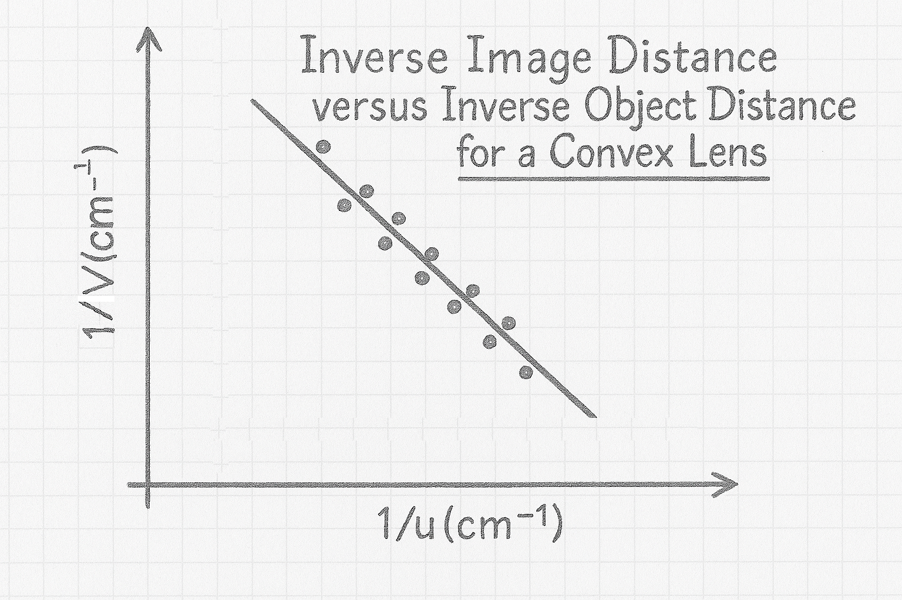

```{css, echo = FALSE}
.justify {
  text-align: justify !important
}
``` 

# Focal Lenght of a Convex Lens

From the cornea in your eye to the camera of your phone, a lens is a critical component of most optical systems. And for a lens, its focal length is key parameter dictating its performance. In today's experiment we will measure thefocal length of a convex (converging, thicker in the center than at the edges) lens.

Take down the following in to your laboratory copy.

### [Title: Focal Length of a Convex Lens]{style="font-family:Kalam;color:#8b1a1a;"}{.unnumbered}

### [Name:]{style="font-family:Kalam;color:#8b1a1a;"}{.unnumbered}

### [Date:]{style="font-family:Kalam;color:#8b1a1a;"}{.unnumbered}

### [Partner:]{style="font-family:Kalam;color:#8b1a1a;"}{.unnumbered}

### [Data:]{style="font-family:Kalam;color:#8b1a1a;"}{.unnumbered}

```{r}
#| warning: false
#| message: false
#| echo: false
#| label: lens_table
#| classes: plain

library(tidyverse)
library(gt)

z <- tibble(u = c(27.0, 29.0, 32.0, 35.0, 38.0, 43.0, 48.0, 56.0, 66.0, 80.0), 
            v = rep("", 10), 
            u_1 = (1/u) |> signif(3), 
            v_1 = rep("", 10)
             )

z |> 
  gt() |> 
  cols_label(u = "Object Distance, u, (cm)",
             v = "Image Distance, v, (cm)",
             u_1 = md("1/u $(cm^{-1})$"),
             v_1 = md("1/v $(cm^{-1})$")) |> 
  cols_width(everything() ~ px(80)) |> 
  fmt_number(columns = c(u),
             decimals = 1) |> 
  fmt_number(columns = c(u_1),
             decimals = 4) |>
  cols_align(columns = everything(),
             align = "center") |> 
  tab_options(container.width = 800,
              table_body.border.bottom.style = "solid",
              table_body.border.bottom.width = "2px",
              table_body.border.bottom.color = "firebrick4",
              column_labels.border.top.style = "solid",
              column_labels.border.top.width = "2px",
              column_labels.border.top.color = "firebrick4",
              table_body.vlines.style = "solid",
              table_body.vlines.width = "2px",
              table_body.vlines.color = "firebrick4",
              column_labels.vlines.style = "solid",
              column_labels.vlines.width = "2px",
              column_labels.vlines.color = "firebrick4") |> 
  tab_options(
    data_row.padding = px(-5),
    table.width = pct(85),
    page.margin.left = "3.0in",
    page.margin.right = "3.0in",
    container.width = pct(85),
    container.overflow.x = FALSE, # Disables horizontal scroll
    container.overflow.y = FALSE  # Disables vertical scroll
  ) |> 
  opt_table_font(size = 17, font = google_font("Kalam"), color = "firebrick4") |> 
  opt_vertical_padding(scale = 0.1)

```

## Experimental Set-Up

:::::: columns
::: {.column width="45%"}

:::

::: {.column width="5%"}
:::

::: {.column width="40%"}
::: {.justify}
The apparatus will be set-up something like the sketch on the left. This is the first point; the lens is quite close to the light source, the screen is at the far end of the bench, and the spring-like image of the bulb filament is quite large on the screen.
:::
:::
::::::

Set the distance between the center of the light source (not the front edge) and the very centre of the lens to be 27.0cm and move the screen until the light bulb filament in sharp focus. Measure the distance between the centre of the lens and the screen. This is $v$, the image distance. Now move the lens back to 27.0 cm, move the screen in to get a sharp focus, and record the new value for $v$. Repeat for all the values for $u$ given in the table above.




- $u$ is measured from the middle of the light assembly, not the front edge

- You get the sharpest focus images when you keep good geometry; the lens and screen being perpendicular to the light beam

- initially the screen will move in towards the light source, but after about $u$ = 43.0 cm is starts to move back again. The final point will have the lens and screen quite close together at the far end of the bench from the light and the image will be very small.

- When filling out your table, pay special attention to significant figures. The number of significant figures for $\frac{1}{v}$ should be the same as for $v$.

## Analysis

:::::: columns
::: {.column width="45%"}
{height="7.5cm" width="8cm"}
:::

::: {.column width="5%"}
:::

::: {.column width="40%"}
::: {.justify}
Draw the graph as shown on the left here, with $\frac{1}{v}$ on the y-axis and $\frac{1}{u}$ on the x axis. Make sure both axes extend at least as far as $0.06 \: cm ^{-1}$, so for a standard $9 \; \times \; 13$ graph paper, use 0.01 per division on the x axis and 0.005 per division on the y axis. Draw a best fit line nested through the points. Make sure the graph has a (long) descriptive title in the form *What's on y-axis vs What's on x axis and the context*.

:::
:::
::::::

Calculate the slope of the best fit line using the formula $slope \; = \; \frac{y_2-y_1}{x_2-x_1}$


According to theory (see below), this line should have a slope close to -1. Note that, because it's a negative slope, the line angles downwards.

## Calculation of the Focal Length, f(cm)

The equation governing the focal length of a lens is:

$\frac{1}{f} \; = \; \frac{1}{u} \; + \; \frac{1}{v}$

$\implies \frac{1}{v} \; = \; -\frac{1}{u} \; + \; \frac{1}{f}$ so when $\frac{1}{u}$ is zero, $\frac{1}{v} \; = \; \frac{1}{f}$.

Take the point where the line cuts the y-axis, take the inverse of this value, and this will be a figure for f.

### f from Direct Measurement

Take the lens out to the lobby outside the lab and under one of the ceiling lights. Hold the lens about 20 cm above the floor and get the ceiling light in focus. Because the light source is so high above, then $u$ is very large and $\frac{1}{u}$ is close to zero, then $\frac{1}{f} \; = \; \frac{1}{v}$ and the focal lenght will be well approximated by the distance between the lens and the image on the floor. Measure this to get a second estimate for f.

### f from no-parallax

:::::: columns
::: {.column width="45%"}
{height="8.5cm" width="8cm"}
:::

::: {.column width="5%"}
:::

::: {.column width="50%"}
::: {.justify}
Set up the apparatus as shown, with the object pin about 10cm behind the lens and the retort stand and pencil about 20cm further back. Observe the object pin through the lens and the pencil directly over the top rim of the lens. Move the retort stand until the pencil sits directly over the image of the object pin and the two stay in sync when you move your head from side to side. Measure the distance from pin to lens, $u$, and the distance from pencil to lens, $-v$. Put the values in to the equation $\frac{1}{f} \; = \; \frac{1}{u} \; + \; \frac{1}{v}$ to calculate a value for f.
:::
:::
::::::



## Discussion

There are four parts to the discussion section. Because we have three experimental values for f, we'll combine our results and textbook value in a table

- ***the main results and manufacturer's value***

```{r}
#| warning: false
#| message: false
#| echo: false
#| label: f_table
#| classes: plain

library(tidyverse)
library(gt)

z <- tibble(source = c("Graph", "Lobby", "No-Parallax", "Manufacturer"),
            value = c("", "", "", "20.0"))

z |> gt() |> 
  cols_label(source = "Source",
             value = "f (cm)")


```

- ***supplementary main result*** - repeat your value for the slope of the graph and compare to the textbook value of -1.

- ***inaccuracies*** - your values for $f$ won't be exactly the same as the manufacturers, nor will your graph be a perfect straight line with a slope of -1. We need to try and account for these discrepancies. Pick one feature of the experiment and investigate whether it is an issue in the accuracy of your results. You'll need to examine the results you have already as well as gathering additional evidence by taking further measurements. Your idea might well be a key issue in the quality of the results we obtain, or it might not be and you are thus ruling it out. Both are valid outcomes of this error analysis.

- ***improvements*** - based on the inaccuracy section above, can you suggest a way in which we could make our experiment better?

## Apparatus

Light source, 20cm lens, screen, two metre sticks, retort stand, finder pin, object pin.
