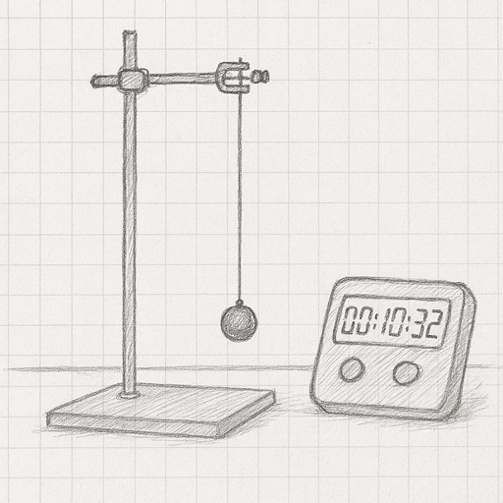
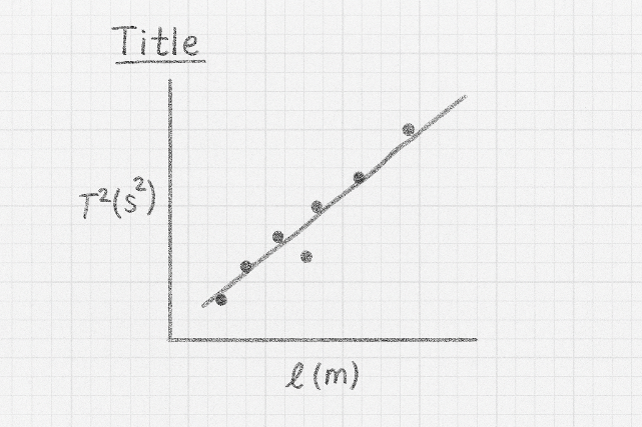

```{css, echo = FALSE}
.justify {
  text-align: justify !important
}
```

# The Simple Pendulum - Determination of 'g'

The simple pendulum is used to determine the acceleration due to gravity, g. A short pendulum swings back and forth rapidly, a long pendulum more slowly. We will use this relationship to determine the acceleration caused by Earth's gravity.

Take down the following in to your laboratory copy.

### [Title: Simple Pendulum - Determination of 'g']{style="font-family:Kalam;color:#8b1a1a;"} {.unnumbered}

### [Name:]{style="font-family:Kalam;color:#8b1a1a;"} {.unnumbered}

### [Date:]{style="font-family:Kalam;color:#8b1a1a;"} {.unnumbered}

### [Partner:]{style="font-family:Kalam;color:#8b1a1a;"} {.unnumbered}

### [Data]{style="font-family:Kalam;color:#8b1a1a;"} {.unnumbered}

```{r}
#| warning: false
#| message: false
#| echo: false
#| label: pendulum_table

library(tidyverse)
library(gt)

z <- tibble(length = seq(0.100, 1.000, by = 0.100) |> signif(digits = 4), 
            actual_length = rep("", 10), 
            t20 = rep("", 10), 
            t1 = rep("", 10), 
            t1_2 = rep("", 10)
             )

z |> 
  gt() |> 
  cols_label(length = "Guide Length (m)",
             actual_length = "Actual Length (m)",
             t20 = md("$T_{20}(s)$"),
             t1 = md("$T_{1}(s)$"),
             t1_2 = md("$T_{1}^2(s^2)$")) |> 
  cols_width(everything() ~ px(160)) |> 
  fmt_number(columns = length,
             decimals = 3) |> 
  cols_align(columns = length,
             align = "center") |> 
  tab_options(container.width = 800,
              table_body.border.bottom.style = "solid",
              table_body.border.bottom.width = "2px",
              table_body.border.bottom.color = "firebrick4",
              column_labels.border.top.style = "solid",
              column_labels.border.top.width = "2px",
              column_labels.border.top.color = "firebrick4",
              table_body.vlines.style = "solid",
              table_body.vlines.width = "2px",
              table_body.vlines.color = "firebrick4",
              column_labels.vlines.style = "solid",
              column_labels.vlines.width = "2px",
              column_labels.vlines.color = "firebrick4") |> 
   tab_options(container.width = 800,
              table_body.border.bottom.style = "solid",
              table_body.border.bottom.width = "2px",
              table_body.border.bottom.color = "firebrick4",
              column_labels.border.top.style = "solid",
              column_labels.border.top.width = "2px",
              column_labels.border.top.color = "firebrick4",
              table_body.vlines.style = "solid",
              table_body.vlines.width = "2px",
              table_body.vlines.color = "firebrick4",
              column_labels.vlines.style = "solid",
              column_labels.vlines.width = "2px",
              column_labels.vlines.color = "firebrick4") |> 
  tab_options(
    data_row.padding = px(-5),
    page.margin.left = "3.0in",
    page.margin.right = "3.0in",
    container.width = pct(75),
    container.overflow.x = FALSE, # Disables horizontal scroll
    container.overflow.y = FALSE  # Disables vertical scroll
  ) |> 
  opt_table_font(size = 17, font = google_font("Kalam"), color = "firebrick4") |> 
  opt_vertical_padding(scale = 0.1)


```

## Experimental Set-Up

The simple pendulum consists of a steel ball suspended by a thread wrapped around a clamped cork. 

::::::: columns
::: {.column width="45%"}
{height="8.5cm" width="8cm"}
:::

::: {.column width="5%"}
:::

:::: {.column width="40%"}
::: justify
The length of the thread can be varied. The length of the pendulum is the distance from the corner of cork where the thread is suspended  to the centre of the ball. For each of six lengths, you will measure the periodic time (period) of the pendulum swing. 

One swing is achieved by holding the ball about 5o from centre, releasing it, and letting it swing across and back. You will time that swing by measuring the time for 20 swings  and divide by 20.

:::
::::
:::::::

•	 Fix the pendulum distance from the corner of the cork to the centre of the ball at about 0.2m. Measure this length, $l$, accurate to 1mm using a metre stick. and note in the table.

•	Measure the time for 20 COMPLETE swings of the pendulum. Record your results in the table.

•	Repeat this for the six lengths of pendulum from 0.2 m to 1.2m.

•	When the time for 20 swings has been recorded for all lengths, divide those values by 20 to determine the periodic time (period). Then, square those values to determine the period squared, $T^2$.

## Analysis

::::::: columns
::: {.column width="45%"}
{height="8.5cm" width="8cm"}
:::

::: {.column width="5%"}
:::

:::: {.column width="40%"}
::: justify
Plot a graph of $T^2$ against $l$ ($T^2$ on the y-axis) by plotting each of the six $T^2$ values versus their corresponding pendulum lengths, $l$. Draw a best fit line though the points and determine the slope of that "best fit line".

Calculate the slope by picking two points on the line $(x_1,y_1)$ close to the origin and $(x_2,y_2)$ far from the origin. Place those x and y values into the equation to calculate the slope: $slope \; = \; \frac{y_2-y_1}{x_2-x_1}$
:::
::::
:::::::

## Calculation of the acceleration due to gravity, g

The equation relating the periodic time T with the length l can be shown to be:

$T \; = \; 2 \pi \sqrt{\frac{l}{g}}$

where g is the acceleration due to gravity, T is measured in seconds and l in metres. 

Squaring and rearranging gives:

$T^2\; = \; \frac{4\pi^2}{g}l$

This means that the slope of our $T^2$ vs 
$l$ graph must be:

$slope \; = \; \frac{4\pi^2}{g} \implies g \; = \; \frac{4\pi^2}{slope}$

Use this to calculate a value for g in $m s^{-2}$.

## Discussion

There are four parts to the discussion section:

•	the main result – repeat the value of g obtained from the end of your calculations. Even though it is written elsewhere in your report, it’s important to repeat it here.

•	the text book value – the true value of g known from many previous experiments

•	inaccuracies – your value for g won’t be exactly the same as the text book answer nor will your graph be a perfect straight line. We need to try and account for these discrepancies. Pick one feature of the experiment and investigate whether it is an issue in the accuracy of for your results. for example, for one length of pendulum, if you repeat the measurement of time for 20 swings, will you get the same answer as when doing the experiment? And for that length of pendulum, will you get same length accurate to 1mm if you measure its length a second time? You'll need to examine the results you have already as well as gather new evidence by taking further measurements. Your idea might well be a key issue in the quality of the results we obtain, or it might not be and you are thus ruling it out. Both are valid outcomes of this errors analysis. 

•	improvements - based on the inaccuracy section above, can you suggest a way in which we could make our experiment better


## Apparatus

Retort stand, cork, thread, bobbin, metre stick, centisecond timer


