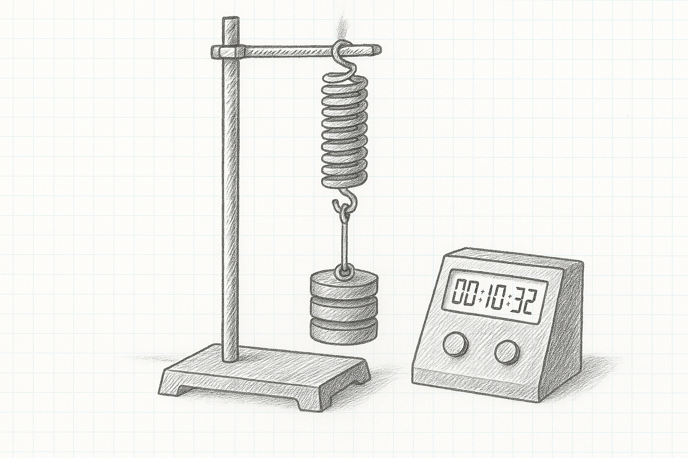

```{css, echo = FALSE}
.justify {
  text-align: justify !important
}
```

# Simple Harmonic Motion of a Spring

As we saw in the previous experiment, every spring has a *stiffness* called its ***Spring Constant***, $k$, measured in Newtons per metre. Stiff, rigid springs have high values of $k$, loose, floppy springs have low values of $k$. We're going to measure $k$ by a totally separate mechanism and compare the new value we get to the previous result.

Take down the following in to your laboratory copy.

### [Title: Simple Harmonic Motion of a Spring]{style="font-family:Kalam;color:#8b1a1a;"} {.unnumbered}

### [Name:]{style="font-family:Kalam;color:#8b1a1a;"} {.unnumbered}

### [Date:]{style="font-family:Kalam;color:#8b1a1a;"} {.unnumbered}

### [Partner:]{style="font-family:Kalam;color:#8b1a1a;"} {.unnumbered}

### [Data:]{style="font-family:Kalam;color:#8b1a1a;"} {.unnumbered}

```{r}
#| warning: false
#| message: false
#| echo: false
#| label: pendulum_table
#| classes: plain

library(tidyverse)
library(gt)

z <- tibble(mass = seq(0.300, 1.000, by = 0.100) |> signif(digits = 4), 
            t20 = rep("", 8), 
            t1 = rep("", 8), 
            t1_2 = rep("", 8)
             )

z |> 
  gt() |> 
  cols_label(mass = "Mass (kg)",
             t20 = md("$T_{20}(s)$"),
             t1 = md("$T_{1}(s)$"),
             t1_2 = md("$T_{1}^2(s^2)$")) |> 
  cols_width(everything() ~ px(120)) |> 
  fmt_number(columns = mass,
             decimals = 3) |> 
  cols_align(columns = everything(),
             align = "center") |> 
  tab_options(container.width = 800,
              table_body.border.bottom.style = "solid",
              table_body.border.bottom.width = "2px",
              table_body.border.bottom.color = "firebrick4",
              column_labels.border.top.style = "solid",
              column_labels.border.top.width = "2px",
              column_labels.border.top.color = "firebrick4",
              table_body.vlines.style = "solid",
              table_body.vlines.width = "2px",
              table_body.vlines.color = "firebrick4",
              column_labels.vlines.style = "solid",
              column_labels.vlines.width = "2px",
              column_labels.vlines.color = "firebrick4") |> 
  tab_options(
    data_row.padding = px(-5),
    page.margin.left = "3.0in",
    page.margin.right = "3.0in",
    container.width = pct(75),
    container.overflow.x = FALSE, # Disables horizontal scroll
    container.overflow.y = FALSE  # Disables vertical scroll
  ) |> 
  opt_table_font(size = 17, font = google_font("Kalam"), color = "firebrick4") |> 
  opt_vertical_padding(scale = 0.1)

```

## Experimental Set-Up

::::::: columns
::: {.column width="45%"}
{height="8.5cm" width="8cm"}
:::

::: {.column width="5%"}
:::

:::: {.column width="40%"}
::: justify
The apparatus will be set-up something like the sketch on the left. This is the first point; the weight holder and two 100g weights giving a total load of 0.300 kg.

Pull the weights down slightly and release, the weights will bounce rapidly. With the centisecond timer, record the time for 20 bounces. Divide this by 20 to get the time for one bounce, and then square this value to get $T^2$. Pay special attention to significant figures
:::
::::
:::::::

- you get best results for small displacements, only pull the weights down the smallest amount you can.

- One ***tick*** happens every time the weights hit the bottom of their travel, so *down, down, down* rather than *up, down, up, down*.

- 0.300 kg is the weight holder and **2** extra weights

- When filling out your table, pay special attention to significant figures. The number of significant figures for $T_{20}$ should be the same as for $T_1$ and $T^2$.

## Analysis

::::::: columns
::: {.column width="45%"}
{height="8.5cm" width="8cm"}
:::

::: {.column width="5%"}
:::

:::: {.column width="40%"}
::: justify
Draw the graph as shown on the left here, with $T^2(s^2)$ on the y-axis and $m(kg)$ on the x axis. Don't be surprised if there is a reasonable amount of scatter in the points. Draw a best fit line nested through the points. Make sure the graph has a (long) descriptive title in the form *What's on y-axis vs What's on x axis and the context*.

Calculate the slope of the best fit line using the formula $slope \; = \; \frac{y_2-y_1}{x_2-x_1}$
:::
::::
:::::::

## Calculation of the Spring Constant, k

The equation governing the simple harmonic motion of the spring is:

$T \; = \; 2 \pi \sqrt{\frac{k}{m}}$

Where $T$ is the period we measured for each mass, $m$, and $k$ is the spring constant that we're setting out to measure.

Squaring and rearranging gives:

$T^2\; = \; \frac{4\pi^2}{k} \times m$

This means the slope of our $T^2 \; vs \; m$ graph must be:

$slope \; = \; \frac{4\pi^2}{k}$

$\implies\; k \; = \; \frac{4\pi^2}{slope}$

Use this to calculate a value for k in N/m

## Discussion

There are four parts to the discussion section:

- ***the main results*** - repeat the value of k obtained from the end of your calculations. Even though it is written elsewhere in your report, it's important to repeat it here

- ***the text book (manufacturers) value*** - the springs used have a rated k value of 100 N/m

- ***inaccuracies*** - your value for $k$ won't be exactly the same as the manufacturers, nor will your graph be a perfect straight line. We need to try and account for these discrepancies. Pick one feature of the experiment and investigate whether it is an issue in the accuracy of your results. For example, are the weights all exactly 100g, does the amplitude of the spring oscillations matter, is there signs of anharmonic behaviour at heavier masses, or is 20 bounces enough. You'll need to examine the results you have already as well as gathering additional evidence by taking further measurements. Your idea might well be a key issue in the quality of the results we obtain, or it might not be and you are thus ruling it out. Both are valid outcomes of this error analysis.

- ***improvements*** - based on the inaccuracy section above, can you suggest a way in which we could make our experiment better?

## Apparatus

Retort stand, weight holder, 9 $\times$ 100g weights, centisecond timer, 100 N/m spring.
