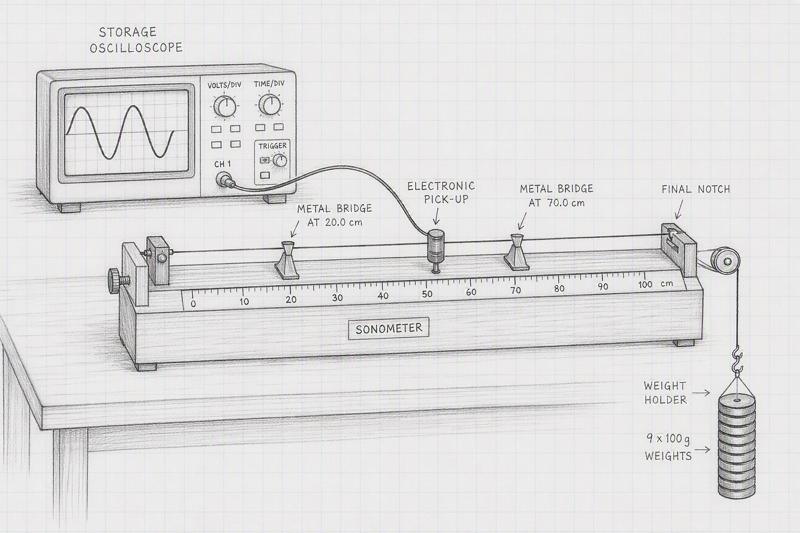
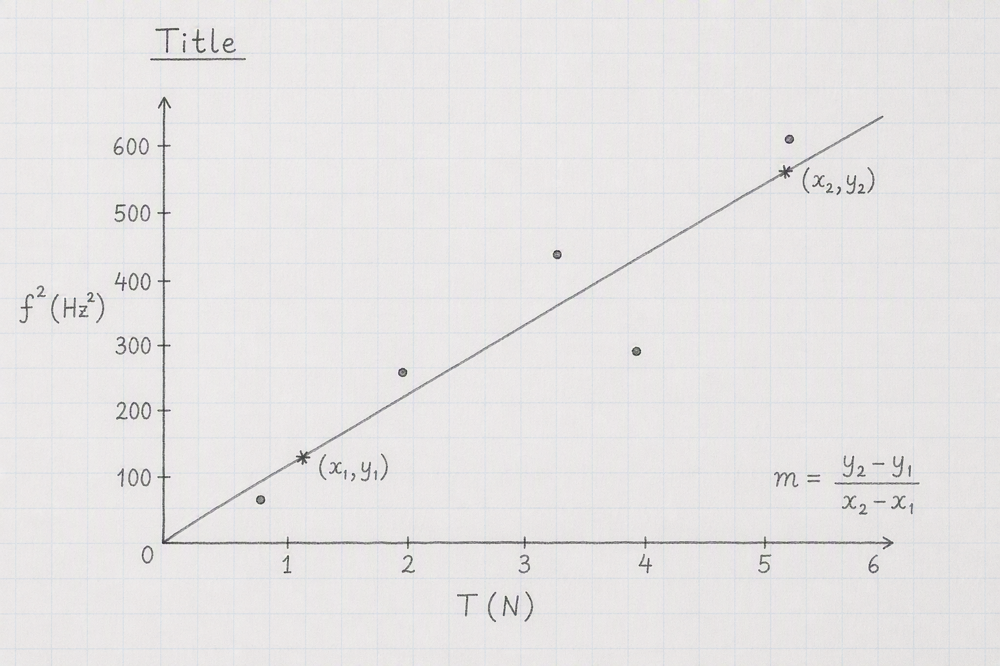

```{css, echo = FALSE}
.justify {
  text-align: justify !important
}
``` 

# Measurements of Sound Frequency using a Sonometer

Today we're going to investigate how the sound produced from a plucked wire depends on the tension in the wire. Our analysis is based on the wave equation, $v \; = \; f \lambda$.

Take down the following in to your laboratory copy.

### [Measurements of Sound Frequency using a Sonometer]{style="font-family:Kalam;color:#8b1a1a;"}{.unnumbered}

### [Name:]{style="font-family:Kalam;color:#8b1a1a;"}{.unnumbered}

### [Date:]{style="font-family:Kalam;color:#8b1a1a;"}{.unnumbered}

### [Partner:]{style="font-family:Kalam;color:#8b1a1a;"}{.unnumbered}

### [Data:]{style="font-family:Kalam;color:#8b1a1a;"}{.unnumbered}

```{r}
#| warning: false
#| message: false
#| echo: false
#| label: track_table
#| classes: plain

library(tidyverse)
library(gt)

z <- tibble(notch = 1:5,
            force = (9.81 * 1:5), 
            f = rep("", 5), 
            f_2 = rep("", 5)
             )

z |> 
  gt() |> 
  cols_label(notch = "Notch",
             force = md("$Tension (N)$"),
             f = md("$Frequency (Hz)$"),
             f_2 = md("$f^2 (Hz^2)$")) |> 
  cols_width(everything() ~ px(120)) |> 
  cols_align(columns = everything(),
             align = "center") |> 
  tab_options(container.width = 800,
              table_body.border.bottom.style = "solid",
              table_body.border.bottom.width = "2px",
              table_body.border.bottom.color = "firebrick4",
              column_labels.border.top.style = "solid",
              column_labels.border.top.width = "2px",
              column_labels.border.top.color = "firebrick4",
              table_body.vlines.style = "solid",
              table_body.vlines.width = "2px",
              table_body.vlines.color = "firebrick4",
              column_labels.vlines.style = "solid",
              column_labels.vlines.width = "2px",
              column_labels.vlines.color = "firebrick4") |> 
  tab_options(
    data_row.padding = px(-5),
    table.width = pct(85),
    page.margin.left = "3.0in",
    page.margin.right = "3.0in",
    container.width = pct(75),
    container.overflow.x = FALSE, # Disables horizontal scroll
    container.overflow.y = FALSE  # Disables vertical scroll
  ) |> 
  opt_table_font(size = 17, font = google_font("Kalam"), color = "firebrick4") |> 
  opt_vertical_padding(scale = 0.1)

```

## Experimental Set-Up

:::::: columns
::: {.column width="40%"}
{height="7cm" width="7.5cm"}
:::

::: {.column width="5%"}
:::

::: {.column width="45%"}
::: {.justify}
The apparatus will be set-up something like the sketch on the left. Pluck te guitar wire in the centre and watch the trace on the oscilloscope screen. When the trace settles down to a nice sinusoidal shape after a second or so, press the pause button on the scope. The frequency will be displayed on the scope screen. Record this, move the weights to a different notch, and repeat the procedure.
:::
:::
::::::

- Record and note down the distance between the bridges on the sonometer. Measure to three decimal places in metres. This is $L$. make sure this doesn't change over the experiment, i.e. don't move the bridges.

- Adjust the tension in the wire so that the lever arm is horizontal.

- It is easiest to start at the fifth and furthest notch, i.e. start from the bottom of the resuts table. It is easier to measure freuency for this setting.

- When filling out your table, pay special attention to significant figures. The number of significant figures for $f^2$ should be the same as for $f$. Using scientific notation is a good idea here with powers of $10^4$.



## Analysis

:::::: columns
::: {.column width="40%"}
{height="7cm" width="7.5cm"}
:::

::: {.column width="5%"}
:::

::: {.column width="45%"}
::: {.justify}
Draw the graph as shown on the left here, with $f^2(Hz^2)$ on the y-axis and $T(N)$ on the y axis. Draw a best fit line nested through the points. Make sure the graph has a (long) descriptive title in the form *What's on y-axis vs What's on x axis and the context*.

Calculate the slope of the best fit line using the formula $slope \; = \; \frac{y_2-y_1}{x_2-x_1}$
:::
:::
::::::

## Calculation of the mass per unit length, $\mu$

The equation of relevance here is: $f \; = \; \frac{1}{2L} \sqrt{ \frac{T}{\mu}}$ where $L$ is the distant between the bridges that we measured.

Squaring both sides and rearranging we get $\mu \; = \; \frac{1}{4L^2 \times slope}$

We're going to check on our $\mu$ value by a separate set of measurements. Detach the wire from the sonometer. Measure its entire length, $D$ in metres between the brass connectors at either end. Now coil up the wire and measure its mass, $m_{wire}$ on the scales. Subtract 0.321g from the mass (this is the mass of the brass connectors). Calculate a second value for $\mu$ using:

$\mu_{direct} \; = \; \frac{m_{wire} - 0.321}{D} \div 1000$ the factor of 1000 is to convert grams to kg.

## Discussion

There are four parts to the discussion section:

Because we have two experimental values for $\mu$, we'll combine our results and textbook value in a table

- ***the main results and manufacturer's value***

```{r}
#| warning: false
#| message: false
#| echo: false
#| label: mu_table
#| classes: plain

library(tidyverse)
library(gt)

z <- tibble(source = c("Sonometer", "Direct", "Manufacturer"),
            value = c("", "", md("$8.6 \\times 10^{-4}$")))

z |> gt() |> 
  cols_label(source = "Source",
             value = md("$\\mu(kgm^{-1})$")) |> 
  fmt_markdown(columns = value)


```

- ***inaccuracies*** - your values for $\mu$ won't be exactly the same, nor will your graph be a perfect straight line. We need to try and account for these discrepancies. Pick one feature of the experiment and investigate whether it is an issue in the accuracy of your results. For example, how repeatable are the measurements of frequency from the oscilloscope, you could repeat several times for one value of T and see how consistent they are. You'll need to examine the results you have already as well as gathering additional evidence by taking further measurements. Your idea might well be a key issue in the quality of the results we obtain, or it might not be and you are thus ruling it out. Both are valid outcomes of this error analysis.

- ***improvements*** - based on the inaccuracy section above, can you suggest a way in which we could make our experiment better?

## Apparatus

Sonometer with 0.17 gauge wire mounted (make sure to check the gauge, should give diameter of mm). Two bridges set roughly 0.7m apart under the wire. detector (not driver) coil connected to channel A of storage oscilloscope. Scope set to *measure* and *frequency* on *Channel A*. Weight holder with total of 1kg. Check that frequency measured from fifth notch is about 250Hz.
