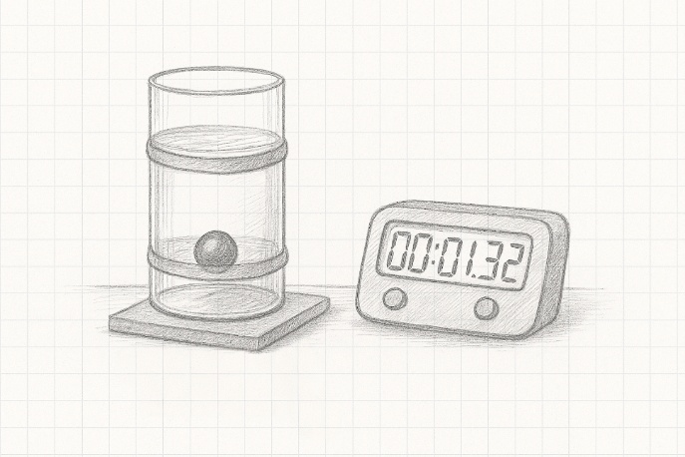
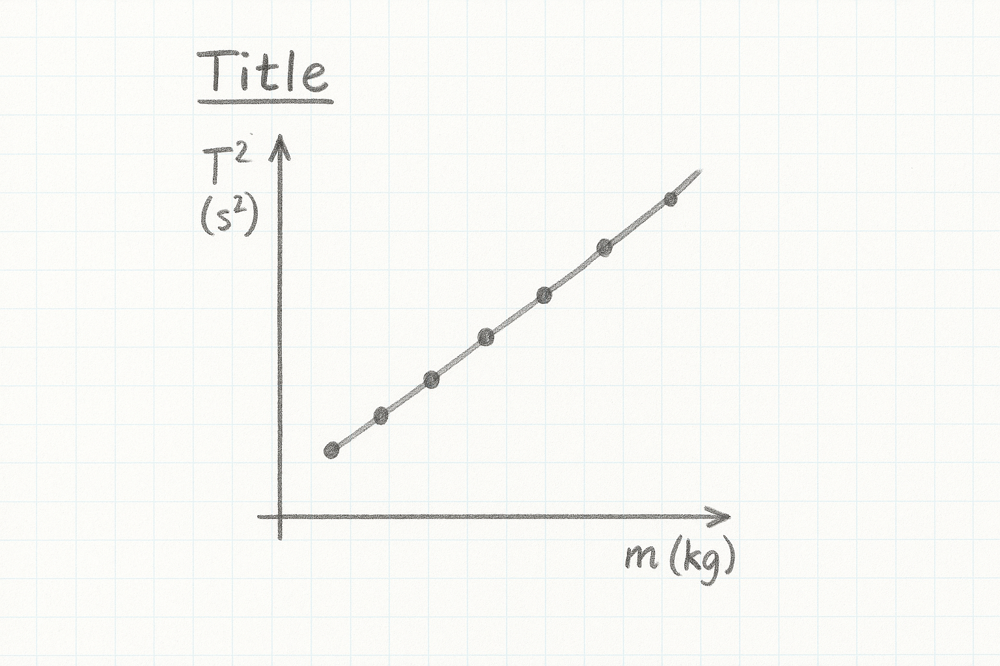

```{css, echo = FALSE}
.justify {
  text-align: justify !important
}
```

# Measurement of the Viscosity of a Liquid

We measure the viscosity of a liquid (glycerol) by timing how ball bearings of different radius fall in the liquid. We then use an equation based on Stokes law to draw a graph of velocity as a function of radius squared. 

Take down the following in to your laboratory copy.

### [Title: Measurement of viscosity of a liquid by falling ball method.]{style="font-family:Kalam;color:#8b1a1a;"} {.unnumbered}

### [Name:]{style="font-family:Kalam;color:#8b1a1a;"} {.unnumbered}

### [Date:]{style="font-family:Kalam;color:#8b1a1a;"} {.unnumbered}

### [Partner:]{style="font-family:Kalam;color:#8b1a1a;"} {.unnumbered}

### [Data:]{style="font-family:Kalam;color:#8b1a1a;"} {.unnumbered}

```{r}
#| warning: false
#| message: false
#| echo: false
#| label: viscosity_table
#| classes: plain

library(tidyverse)
library(gt)

z <- tibble(diam = c(5.0, 6.0, 7.0, 9.0, 10.0, 12.0) |> signif(digits = 1), 
            rad = rep("", 6), 
            time = rep("", 6), 
            velocity = rep("", 6)
             )

z |> 
  gt() |> 
  cols_label(diam = "Diameter, d, (mm)",
             rad = md("$Radius^2, r^2, (m^2)$"),
             time = md("$time(s)$"),
             velocity = md("Velocity (m/s)")) |> 
  cols_width(everything() ~ px(120)) |> 
  fmt_number(columns = diam,
             decimals = 1) |> 
  cols_align(columns = everything(),
             align = "center") |> 
  tab_options(container.width = 800,
              table_body.border.bottom.style = "solid",
              table_body.border.bottom.width = "2px",
              table_body.border.bottom.color = "firebrick4",
              column_labels.border.top.style = "solid",
              column_labels.border.top.width = "2px",
              column_labels.border.top.color = "firebrick4",
              table_body.vlines.style = "solid",
              table_body.vlines.width = "2px",
              table_body.vlines.color = "firebrick4",
              column_labels.vlines.style = "solid",
              column_labels.vlines.width = "2px",
              column_labels.vlines.color = "firebrick4") |> 
  tab_options(
    data_row.padding = px(-5),
    page.margin.left = "3.0in",
    page.margin.right = "3.0in",
    container.width = pct(75),
    container.overflow.x = FALSE, # Disables horizontal scroll
    container.overflow.y = FALSE  # Disables vertical scroll
  ) |> 
  opt_table_font(size = 17, font = google_font("Kalam"), color = "firebrick4") |> 
  opt_vertical_padding(scale = 0.1)

```

## Experimental Set-Up

::::::: columns
::: {.column width="45%"}
{height="8.5cm" width="8cm"}
:::

::: {.column width="5%"}
:::

:::: {.column width="40%"}
::: justify
 The set up consists of a glass cylinder filled with glycerol.  There are two elastic bands around the cylinder that can be varied.  The ball bearings are covered in the liquid and gently let drop in the liquid.  A timer is used to measure the time for the ball bearing to fall from one band to the other. Each ball bearing is dropped and the time taken.  The table above is used to fill in the results.  
The velocity of the ball bearing is the distance between the bands in meters divided by the time in seconds.  That is $v \; = \; \frac{d}{t}$  . 

:::
::::
:::::::

- you get best results for small displacements, only pull the weights down the smallest amount you can.

- One ***tick*** happens every time the weights hit the bottom of their travel, so *down, down, down* rather than *up, down, up, down*.

- 0.300 kg is the weight holder and **2** extra weights

- When filling out your table, pay special attention to significant figures. The number of significant figures for $T_{20}$ should be the same as for $T_1$ and $T^2$.

## Analysis

::::::: columns
::: {.column width="45%"}
{height="8.5cm" width="8cm"}
:::

::: {.column width="5%"}
:::

:::: {.column width="40%"}
::: justify
Draw the graph as shown on the left here, with $T^2(s^2)$ on the y-axis and $m(kg)$ on the x axis. Don't be surprised if there is a reasonable amount of scatter in the points. Draw a best fit line nested through the points. Make sure the graph has a (long) descriptive title in the form *What's on y-axis vs What's on x axis and the context*.

Calculate the slope of the best fit line using the formula $slope \; = \; \frac{y_2-y_1}{x_2-x_1}$
:::
::::
:::::::

## Calculation of the Viscosity


The equation used to calculate the viscosity is given by

$V=\frac{2}{9} \frac{gr^2\left(\rho _o-\rho_L\right)\ }{\mathcal{n}}$
 Where $\eta$ is the viscosity of the liquid.  The units of viscosity are Pas

g is the acceleration due to gravity, $\rho_o$ and $\rho_L$ are the densities of the ball bearings and the liquid respectively.  For the case of steel ball bearings and glycerol the densities are o= 7800 kg/m3 and L= 1800 kg/m3
A graph of V as a function of r2 is a straight line of slope 

$Slope \; = \; \frac{2}{9} \frac{g\left(\rho _o-\rho_L\right)\ }{\mathcal{n}}$
$\implies \eta \; = \; \frac{2}{9} \frac{g\left(\rho _o-\rho_L\right)\ }{slope}$


## Discussion

There are four parts to the discussion section:

- ***the main results*** - repeat the value of $\eta$ obtained from the end of your calculations. Even though it is written elsewhere in your report, it's important to repeat it here

- ***the text book (manufacturers) value*** - the liquid has a viscosity of $\eta \; = \; 2Pas$

- ***inaccuracies*** - your value for $\eta$ won't be exactly the same as the manufacturers, nor will your graph be a perfect straight line. We need to try and account for these discrepancies. Pick one feature of the experiment and investigate whether it is an issue in the accuracy of your results. You'll need to examine the results you have already as well as gathering additional evidence by taking further measurements. Your idea might well be a key issue in the quality of the results we obtain, or it might not be and you are thus ruling it out. Both are valid outcomes of this error analysis.

- ***improvements*** - based on the inaccuracy section above, can you suggest a way in which we could make our experiment better?

## Apparatus

Graduated cylinder filled to at least 70% with glycerol. Rubber bands ~ 1cm below the top of the liquid and ~2cm above the base of the cylinder. Centisecond timer. Meter stick. Magnetised steel ball bearings of sizes given in the table above.
